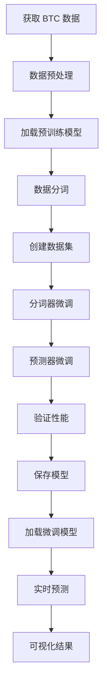

# Kronos BTC 微调与预测系统

<div align="center">

[](https://python.org)
[](https://pytorch.org)
[](LICENSE)

**基于 Kronos 金融预测模型的 BTC 数据微调与预测实践**

</div>

## 📖 项目简介

本项目是基于 [Kronos](https://github.com/shiyu-coder/Kronos) 金融预测模型的完整微调与预测系统，专门针对 BTC/USDT 交易对进行模型优化和价格预测。Kronos 是第一个开源的金融K线（蜡烛图）基础模型，在45个全球交易所的数据上进行训练。

### 🎯 项目特色

- **完整工作流程**：从数据获取到模型微调再到预测应用的全链路实现
- **真实数据驱动**：使用币安实时BTC数据进行模型训练和预测
- **两阶段微调**：完整的分词器和预测器微调流程
- **实时预测系统**：支持实时数据获取和价格预测
- **可视化展示**：提供直观的预测结果可视化

## ✨ 核心功能

### 📈 数据获取模块
- **历史数据爬取**：获取指定时间范围的 BTC/USDT K线数据
- **实时数据监控**：持续获取最新市场数据
- **多格式输出**：支持 CSV 和 JSON 格式
- **数据统计**：自动生成详细的数据统计报告

### 🤖 模型微调
- **真实微调流程**：完整的两阶段微调（分词器 + 预测器）
- **分层词元处理**：使用 KronosTokenizer 进行数据分词
- **时间序列分割**：严格按时间顺序分割训练/验证/测试集
- **训练监控**：实时显示训练进度和损失变化
- **分布式训练**：支持多GPU并行训练

### 📊 预测系统
- **实时预测**：基于微调模型进行BTC价格预测
- **多时间框架**：支持不同时间间隔的预测
- **可视化展示**：生成价格和成交量预测图表
- **结果保存**：自动保存预测结果和可视化图表

## 🚀 快速开始

### 环境要求

- Python 3.10+
- PyTorch 2.0+
- CUDA 支持（推荐）
- 8GB+ GPU 显存（推荐）

### 安装依赖

```bash
pip install -r requirements.txt
```

### 1. 获取 BTC 数据

#### 获取历史数据
```bash
cd get_btc_data
python get_Data_of_all.py
```

#### 启动实时数据监控
```bash
cd get_btc_data
python get_Data_of_realtime.py
```

### 2. 微调模型

#### 使用配置文件进行微调
```bash
cd Kronos/finetune_csv
python train_sequential.py --config configs/config_btcusdt_1h.yaml
```

#### 分布式训练（多GPU）
```bash
cd Kronos/finetune_csv
DIST_BACKEND=nccl torchrun --standalone --nproc_per_node=4 train_sequential.py --config configs/config_btcusdt_1h.yaml
```

### 3. 运行预测

```bash
python btc_prediction.py
```

## 📁 项目结构

```
Kronos-of-my/
├── btc_prediction.py              # 主预测脚本
├── requirements.txt               # 项目依赖
├── data/                          # 数据存储目录
│   ├── BTCUSDT_1h_*.csv          # BTC K线数据
│   ├── BTCUSDT_1h_*.json         # JSON格式数据
│   └── BTCUSDT_1h_*_stats.json   # 数据统计信息
├── get_btc_data/                 # 数据获取模块
│   ├── get_Data_of_all.py        # 历史数据爬取
│   ├── get_Data_of_realtime.py   # 实时数据监控
│   └── README.md                 # 数据获取说明
├── Kronos/                       # Kronos 母项目
│   ├── model/                    # 模型定义
│   ├── tokenizer/                # 预训练分词器
│   ├── finetune_csv/             # CSV数据微调模块
│   │   ├── train_sequential.py   # 顺序训练脚本
│   │   ├── finetune_tokenizer.py # 分词器微调
│   │   ├── finetune_base_model.py # 预测器微调
│   │   ├── configs/              # 配置文件
│   │   │   └── config_btcusdt_1h.yaml
│   │   └── finetuned/            # 微调后的模型
│   │       └── BTCUSDT_1h_finetune/
│   └── examples/                 # 示例脚本
└── README.md                     # 项目说明文档
```

## 🔧 详细使用说明

### 数据获取配置

#### 历史数据获取参数
```python
# get_btc_data/get_Data_of_all.py
symbol = "BTCUSDT"      # 交易对
interval = "1h"         # 时间框架
days = 730              # 获取天数（默认2年）
```

#### 实时数据监控参数
```python
# get_btc_data/get_Data_of_realtime.py
symbol = "BTCUSDT"          # 交易对
interval = "1h"             # 时间框架
update_interval = 60        # 更新间隔（秒）
backfill_hours = 24         # 启动时回填小时数
```

### 微调配置

主要配置参数在 `Kronos/finetune_csv/configs/config_btcusdt_1h.yaml` 中：

```yaml
data:
  data_path: "data/BTCUSDT_1h_20251018_220012.csv"
  lookback_window: 512        # 历史数据窗口
  predict_window: 48          # 预测窗口
  max_context: 512           # 最大上下文长度
  train_ratio: 0.9           # 训练集比例
  val_ratio: 0.1             # 验证集比例

training:
  tokenizer_epochs: 30       # 分词器训练轮数
  basemodel_epochs: 20       # 预测器训练轮数
  batch_size: 32             # 批次大小
  tokenizer_learning_rate: 0.0002  # 分词器学习率
  predictor_learning_rate: 0.000001 # 预测器学习率

model_paths:
  pretrained_tokenizer: "Kronos/tokenizer"
  pretrained_predictor: "Kronos/model/Kronos-base"
  exp_name: "BTCUSDT_1h_finetune"
```

### 预测配置

预测脚本 `btc_prediction.py` 的主要参数：

```python
# 模型路径
tokenizer_path = "./Kronos/finetune_csv/finetuned/BTCUSDT_1h_finetune/tokenizer/best_model"
model_path = "./Kronos/finetune_csv/finetuned/BTCUSDT_1h_finetune/basemodel/best_model"

# 预测参数
lookback_window = 512        # 历史数据窗口
pred_len = 48                # 预测长度
sample_count = 5             # 采样次数
```

## 📊 微调流程

本项目实现了完整的 Kronos 微调流程：



### 微调步骤详解

1. **数据获取与预处理**
   - 从币安API获取BTC历史K线数据
   - 数据清洗和格式验证
   - 提取 OHLCV 特征

2. **模型加载**
   - 加载预训练的 Kronos-base 模型
   - 加载对应的分词器
   - 设备配置（CPU/GPU）

3. **数据分词**
   - 使用 KronosTokenizer 将连续数据转换为离散词元
   - 生成分层词元序列
   - 处理上下文长度限制

4. **分词器微调**
   - 第一阶段：微调分词器以适应BTC数据分布
   - 使用交叉熵损失进行训练
   - 保存最佳分词器模型

5. **预测器微调**
   - 第二阶段：使用微调后的分词器微调预测器
   - 自回归训练方式
   - 保存最佳预测器模型

6. **预测应用**
   - 加载微调后的模型
   - 获取最新数据
   - 生成未来价格预测
   - 可视化预测结果

## 📈 训练示例

运行微调脚本后，您将看到类似以下的输出：

```
============================================================
Starting Tokenizer Fine-tuning Phase
============================================================
Loading pretrained tokenizer...
Tokenizer parameters: 2,097,152
=== Training Configuration ===
Data path: data/BTCUSDT_1h_20251018_220012.csv
Lookback window: 512
Predict window: 48
Batch size: 32
Learning rate: 0.0002
Training epochs: 30
Device: cuda:0

Starting tokenizer fine-tuning training...
Epoch 1/30: 100%|██████████| 60/60 [00:45<00:00,  1.33it/s, loss=2.345]
...
Tokenizer training completed! Best validation loss: 1.2345
Training time: 25.30 minutes

============================================================
Starting Basemodel Fine-tuning Phase
============================================================
Loading fine-tuned tokenizer...
Loading pretrained predictor...
Model parameters: 102,300,000
=== Training Configuration ===
Data path: data/BTCUSDT_1h_20251018_220012.csv
Lookback window: 512
Predict window: 48
Batch size: 32
Learning rate: 0.000001
Training epochs: 20
Device: cuda:0

Starting fine-tuning training...
Epoch 1/20: 100%|██████████| 60/60 [02:15<00:00,  1.07s/it, loss=3.456]
...
Basemodel training completed! Best validation loss: 2.5678
Training time: 45.20 minutes

============================================================
Training completed!
============================================================
Total training time: 70.50 minutes
Tokenizer model: ./Kronos/finetune_csv/finetuned/BTCUSDT_1h_finetune/tokenizer/best_model
Basemodel model: ./Kronos/finetune_csv/finetuned/BTCUSDT_1h_finetune/basemodel/best_model
============================================================
```

## 🎯 预测示例

运行预测脚本后，您将看到：

```
============================================================
BTC价格预测系统
============================================================
正在加载微调后的模型...
Tokenizer已加载: ./Kronos/finetune_csv/finetuned/BTCUSDT_1h_finetune/tokenizer/best_model
模型已加载: ./Kronos/finetune_csv/finetuned/BTCUSDT_1h_finetune/basemodel/best_model

正在获取最近30天的BTC数据...
成功获取720条数据记录
数据时间范围: 2024-09-20 02:49:54 到 2024-10-20 02:49:54

正在预处理数据...
预处理完成，使用最后512条数据作为输入
输入数据时间范围: 2024-10-01 02:49:54 到 2024-10-20 02:49:54

正在预测未来48小时的BTC价格...
使用设备: cuda
预测完成!

预测结果预览:
                        open      high       low     close     volume
2024-10-20 03:49:54  67345.60  67456.80  67123.20  67345.60     123.45
2024-10-20 04:49:54  67350.20  67460.40  67128.80  67350.20     125.67
...

正在生成可视化图表...
图表已保存: btc_prediction_20241020_025054.png

预测结果已保存: btc_prediction_20241020_025054.csv
合并数据已保存: btc_combined_20241020_025054.csv

预测完成!
```

## 🎨 可视化结果

系统会自动生成包含以下内容的可视化图表：

1. **价格预测图**：显示历史价格和预测价格
2. **成交量预测图**：显示历史成交量和预测成交量
3. **时间轴标注**：清晰的时间刻度和数据点

## 🎯 性能优化建议

### 硬件配置
- **GPU**：推荐使用 NVIDIA GPU（8GB+ 显存）
- **内存**：建议 16GB+ 系统内存
- **存储**：SSD 硬盘提升数据加载速度

### 训练参数调优
- **批次大小**：根据显存调整，通常 16-64
- **学习率**：分词器 1e-4 到 1e-3，预测器 1e-6 到 1e-5
- **训练轮数**：分词器 20-50 轮，预测器 10-30 轮
- **上下文长度**：不超过模型最大限制（512）

### 数据质量
- **数据量**：建议至少 6 个月的历史数据
- **数据频率**：1小时级别数据效果较好
- **数据清洗**：确保数据完整性和一致性

## 🐛 常见问题

### Q1: 模型加载失败怎么办？
A: 检查网络连接，确保能够访问 Hugging Face 模型库。也可以考虑手动下载模型文件到本地。

### Q2: 内存不足错误？
A: 减小批次大小或使用更小的模型（如 Kronos-small）。也可以使用梯度累积来模拟更大的批次。

### Q3: 训练速度很慢？
A: 确保使用 GPU 加速，检查 CUDA 安装是否正确。考虑使用多GPU分布式训练。

### Q4: 数据获取失败？
A: 检查网络连接和币安 API 可用性，脚本已内置重试机制。如果问题持续，可以尝试更换网络或使用代理。

### Q5: 预测结果不准确？
A: 
- 检查训练数据质量和数量
- 调整模型超参数
- 增加训练轮数
- 尝试不同的时间框架
- 考虑使用更多特征数据

### Q6: 如何评估模型性能？
A: 
- 使用验证集损失作为主要指标
- 计算预测准确率、MAE、RMSE等指标
- 进行回测验证
- 比较不同模型的预测效果

## 📝 开发计划

- [ ] 支持更多交易对（ETH、BNB等）
- [ ] 添加模型评估指标和回测功能
- [ ] 实现自动化训练流水线
- [ ] 添加Web界面和API服务
- [ ] 支持实时交易信号生成
- [ ] 集成更多数据源
- [ ] 添加模型版本管理
- [ ] 支持模型热更新

## 🤝 贡献指南

欢迎提交 Issue 和 Pull Request！

1. Fork 本项目
2. 创建特性分支 (`git checkout -b feature/AmazingFeature`)
3. 提交更改 (`git commit -m 'Add some AmazingFeature'`)
4. 推送到分支 (`git push origin feature/AmazingFeature`)
5. 开启 Pull Request

### 贡献方向
- 代码优化和bug修复
- 新功能开发
- 文档改进
- 性能优化
- 测试用例编写

## 🙏 致谢

- [Kronos](https://github.com/shiyu-coder/Kronos) - 原始金融预测模型
- [Hugging Face](https://huggingface.co/) - 模型托管平台
- [币安](https://binance.com) - 数据来源
- [PyTorch](https://pytorch.org/) - 深度学习框架

## 📞 联系方式

如有问题或建议，请通过以下方式联系：
- 提交 GitHub Issue
- 发送微信好友申请至菌子 [+8615252810681]

## ⚠️ 免责声明

**重要提示：**
- 本项目仅供学习和研究使用
- 预测结果不构成投资建议
- 数字货币交易存在高风险，请谨慎投资
- 作者不对使用本系统造成的任何损失承担责任

---

<div align="center">

**⭐ 如果这个项目对您有帮助，请给个 Star！**

</div>