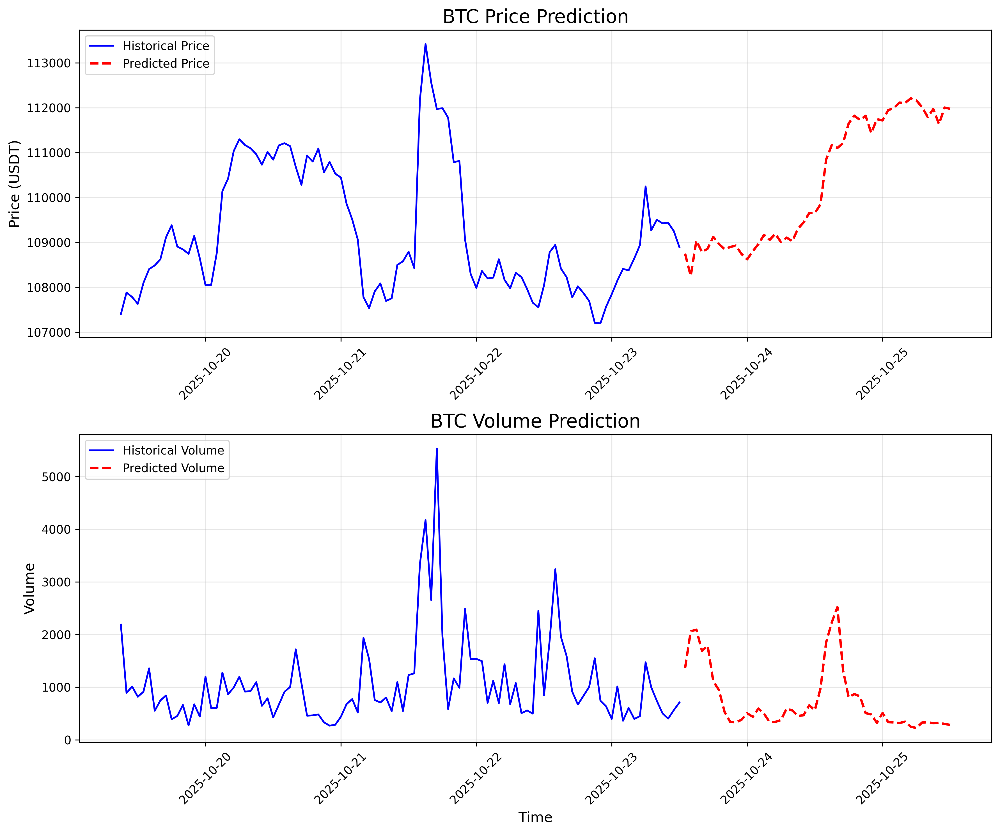
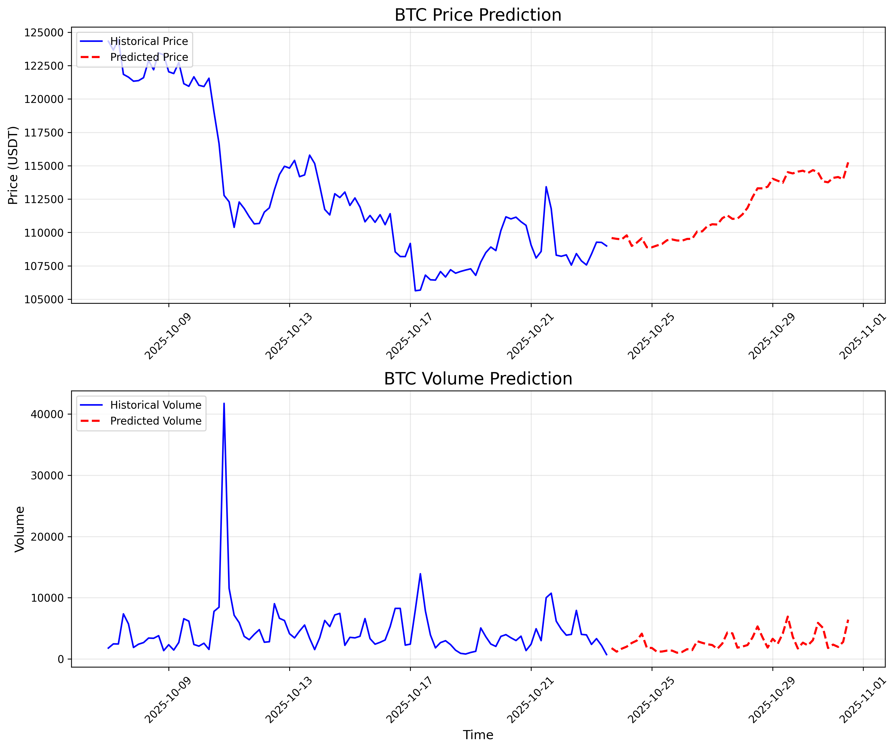

# Kronos BTC Fine-tuned Prediction Model

<div align="center">

[](https://python.org)
[](https://pytorch.org)
[](https://huggingface.co/lc2004)


**BTC/USDT Fine-tuned Prediction based on Kronos Financial Prediction Model**

</div>

## 📖 项目简介 | Project Introduction

本项目提供基于 [Kronos](https://github.com/shiyu-coder/Kronos) 金融预测模型针对 **BTC/USDT** 交易对的微调模型和预测结果。Kronos 是第一个开源的金融K线（蜡烛图）基础模型，在45个全球交易所的数据上进行训练。

This project provides fine-tuned models and prediction results for **BTC/USDT** trading pairs based on the [Kronos](https://github.com/shiyu-coder/Kronos) financial prediction model. Kronos is the first open-source financial candlestick base model trained on data from 45 global exchanges.

**项目特点 | Project Features**：
- 🎯 专注于微调结果和预测应用 | Focus on fine-tuning results and prediction applications
- 📦 包含完整的 Kronos 框架（与官方仓库保持同步） | Complete Kronos framework (synced with official repository)
- 🚀 即插即用的预测脚本 | Plug-and-play prediction scripts
- 📊 提供微调后的模型权重和预测结果 | Fine-tuned model weights and prediction results
- 🤗 模型已上传至 Hugging Face，便于下载使用 | Models uploaded to Hugging Face for easy download

**注意 | Note**：本项目不公开微调的具体细节和训练过程，仅提供可用的模型和预测脚本。| This project does not disclose the specific details and training process of fine-tuning, only provides available models and prediction scripts.

## ℹ️ 项目版本 | Project Version

- **当前版本 | Current Version**：1.2.0
- **更新时间 | Update Time**：2025年10月28日 | October 28, 2025
- **项目定位 | Project Positioning**：微调结果发布 | Fine-tuning Results Release
- **最新更新 | Latest Updates**：
  - ✅ 新增实时预测监控系统（Dash Web界面）| Added real-time prediction monitoring system (Dash Web interface)
  - ✅ 增强可视化效果，支持详细K线图和成交量指标 | Enhanced visualization effects, supporting detailed candlestick charts and volume indicators
  - ✅ 添加预测验证脚本 `btc_1h_val.py` | Added prediction validation script `btc_1h_val.py`
  - ✅ 改进错误处理和调试信息 | Improved error handling and debugging information
  - ✅ 支持用户自定义刷新间隔 | Support for user-defined refresh intervals
  - ✅ 新增 4 小时时间框架预测模型 | Added 4-hour timeframe prediction model
  - ✅ 支持 1h 和 4h 两种时间粒度预测 | Support for 1h and 4h time granularity predictions

## ✨ 核心功能 | Core Features

- **多时间框架预测 | Multi-timeframe Prediction**：支持 1 小时和 4 小时两种时间粒度预测 | Support for 1-hour and 4-hour time granularity predictions
- **实时预测监控 | Real-time Prediction Monitoring**：基于 Dash 的 Web 界面实时监控系统 | Dash-based web interface real-time monitoring system
- **交互式可视化 | Interactive Visualization**：详细K线图、成交量指标、预测区域标记 | Detailed candlestick charts, volume indicators, prediction area markers
- **自动刷新 | Auto Refresh**：支持用户自定义刷新间隔（1-1440分钟）| Support for user-defined refresh intervals (1-1440 minutes)
- **预测验证 | Prediction Validation**：专门的验证脚本用于测试和可视化 | Specialized validation scripts for testing and visualization
- **开箱即用 | Ready to Use**：无需微调，直接使用预训练模型 | No fine-tuning required, direct use of pre-trained models
- **数据获取工具 | Data Acquisition Tools**：包含 BTC 数据爬取脚本 | Includes BTC data scraping scripts
- **云端模型 | Cloud Models**：从 Hugging Face 一键下载 | One-click download from Hugging Face

## 🚀 快速开始 | Quick Start

### 环境要求 | Environment Requirements

- Python 3.10+
- PyTorch 2.0+
- CUDA support (recommended, GPU improves prediction speed)

### 安装依赖 | Install Dependencies

```bash
pip install -r requirements.txt
```

### 下载模型 | Download Models

模型已上传至 Hugging Face，请根据需要下载对应时间框架的模型：| Models have been uploaded to Hugging Face, please download the corresponding timeframe models as needed:

#### 🤗 方法一：使用 Hugging Face CLI（推荐）| Method 1: Using Hugging Face CLI (Recommended)

**1 小时时间框架模型 | 1-hour Timeframe Model:**
```bash
# 下载 1h 微调模型 | Download 1h fine-tuned model
huggingface-cli download lc2004/kronos_base_model_BTCUSDT_1h_finetune --local-dir ./BTCUSDT_1h_finetune/basemodel/best_model

# 下载 1h Tokenizer | Download 1h Tokenizer
huggingface-cli download lc2004/kronos_tokenizer_base_BTCUSDT_1h_finetune --local-dir ./BTCUSDT_1h_finetune/tokenizer/best_model
```

**4 小时时间框架模型 | 4-hour Timeframe Model:**
```bash
# 下载 4h 微调模型 | Download 4h fine-tuned model
huggingface-cli download lc2004/kronos_base_model_BTCUSDT_4h_finetune --local-dir ./BTCUSDT_4h_finetune/basemodel/best_model

# 下载 4h Tokenizer | Download 4h Tokenizer
huggingface-cli download lc2004/kronos_tokenizer_base_BTCUSDT_4h_finetune --local-dir ./BTCUSDT_4h_finetune/tokenizer/best_model
```

#### 🌐 方法二：手动下载 | Method 2: Manual Download

从以下 Hugging Face 仓库手动下载：| Manually download from the following Hugging Face repositories:

**1 小时时间框架 | 1-hour Timeframe:**
1. **微调模型 | Fine-tuned Model**：[lc2004/kronos_base_model_BTCUSDT_1h_finetune](https://huggingface.co/lc2004/kronos_base_model_BTCUSDT_1h_finetune)
   - 放置到 | Place in：`./BTCUSDT_1h_finetune/basemodel/best_model`

2. **Tokenizer**：[lc2004/kronos_tokenizer_base_BTCUSDT_1h_finetune](https://huggingface.co/lc2004/kronos_tokenizer_base_BTCUSDT_1h_finetune)
   - 放置到 | Place in：`./BTCUSDT_1h_finetune/tokenizer/best_model`

**4 小时时间框架 | 4-hour Timeframe:**
3. **微调模型 | Fine-tuned Model**：[lc2004/kronos_base_model_BTCUSDT_4h_finetune](https://huggingface.co/lc2004/kronos_base_model_BTCUSDT_4h_finetune)
   - 放置到 | Place in：`./BTCUSDT_4h_finetune/basemodel/best_model`

4. **Tokenizer**：[lc2004/kronos_tokenizer_base_BTCUSDT_4h_finetune](https://huggingface.co/lc2004/kronos_tokenizer_base_BTCUSDT_4h_finetune)
   - 放置到 | Place in：`./BTCUSDT_4h_finetune/tokenizer/best_model`

### 运行预测 | Run Predictions

模型下载完成后，根据需要运行对应的预测脚本：| After downloading the models, run the corresponding prediction scripts as needed:

#### 🔄 实时预测监控（推荐）| Real-time Prediction Monitoring (Recommended)

**1 小时时间框架实时监控 | 1-hour Timeframe Real-time Monitoring:**
```bash
python btc_1h_prediction_loop.py
```

**1 小时时间框架预测验证 | 1-hour Timeframe Prediction Validation:**
```bash
python btc_1h_val.py
```

实时监控系统特性 | Real-time Monitoring System Features:
- 🌐 基于 Dash 的 Web 界面 | Dash-based web interface
- 📊 交互式K线图和成交量图表 | Interactive candlestick charts and volume charts
- ⚡ 实时数据更新和预测 | Real-time data updates and predictions
- ⏱️ 可自定义刷新间隔（1-1440分钟）| Customizable refresh intervals (1-1440 minutes)
- 📈 详细的价格变化统计 | Detailed price change statistics
- 🎨 专业的深色主题界面 | Professional dark theme interface

#### 📈 单次预测 | Single Prediction

**1 小时时间框架预测（预测未来 48 小时）| 1-hour Timeframe Prediction (predict next 48 hours):**
```bash
python btc_1h_prediction.py
```

**4 小时时间框架预测（预测未来 192 小时/8 天）| 4-hour Timeframe Prediction (predict next 192 hours/8 days):**
```bash
python btc_4h_prediction.py
```

预测结果将自动保存到输出目录。| Prediction results will be automatically saved to the output directory.

> **💡 提示 | Tips**：
> - 1h 模型适合短期预测（1-2天）| 1h model is suitable for short-term prediction (1-2 days)
> - 4h 模型适合中期预测（3-7天）| 4h model is suitable for medium-term prediction (3-7 days)
> - 建议结合两种时间框架的预测结果进行综合分析| It's recommended to combine predictions from both timeframes for comprehensive analysis
> - 实时监控系统适合持续跟踪市场变化| Real-time monitoring system is suitable for continuous market tracking

## 🌐 实时监控系统详细说明 | Real-time Monitoring System Details

### 启动实时监控 | Start Real-time Monitoring

```bash
# 启动 1 小时时间框架实时监控 | Start 1-hour timeframe real-time monitoring
python btc_1h_prediction_loop.py
```

启动后，系统会自动打开浏览器并访问 `http://127.0.0.1:8050`| After startup, the system will automatically open the browser and access `http://127.0.0.1:8050`

### 界面功能 | Interface Features

#### 📊 主要显示区域 | Main Display Area
- **K线图 | Candlestick Chart**：显示最近100条历史数据和48小时预测数据 | Display recent 100 historical data points and 48-hour prediction data
- **成交量图 | Volume Chart**：对应时间段的成交量柱状图 | Volume bar chart for corresponding time periods
- **预测起点标记 | Prediction Start Marker**：黄色虚线标记历史数据和预测数据的分界点 | Yellow dashed line marking the boundary between historical and prediction data

#### 📈 实时统计信息 | Real-time Statistics
- **当前价格 | Current Price**：最新的BTC/USDT价格 | Latest BTC/USDT price
- **预测价格 | Predicted Price**：预测周期结束时的价格 | Price at the end of the prediction period
- **预期变化 | Expected Change**：价格变化金额和百分比 | Price change amount and percentage
- **预测时长 | Prediction Duration**：预测覆盖的小时数 | Number of hours covered by prediction
- **预测至 | Predict Until**：预测结束时间 | Prediction end time

#### ⚙️ 控制面板 | Control Panel
- **刷新间隔设置 | Refresh Interval Settings**：可设置1-1440分钟的自动刷新间隔 | Settable auto-refresh interval from 1-1440 minutes
- **应用按钮 | Apply Button**：应用新的刷新间隔设置 | Apply new refresh interval settings
- **状态显示 | Status Display**：显示当前设置状态 | Display current settings status

#### 🕐 时间信息 | Time Information
- **最后更新时间 | Last Update Time**：显示最近一次预测更新的时间 | Display the most recent prediction update time
- **下次更新时间 | Next Update Time**：显示下次自动更新的时间 | Display the next automatic update time
- **刷新倒计时 | Refresh Countdown**：显示距离下次更新的剩余时间 | Display remaining time until next update

### 可视化特性 | Visualization Features

#### 🎨 图表样式 | Chart Styles
- **历史数据 | Historical Data**：实线K线，绿色上涨/红色下跌 | Solid line candlesticks, green for rise/red for fall
- **预测数据 | Predicted Data**：半透明K线，青色上涨/橙色下跌 | Semi-transparent candlesticks, cyan for rise/orange for fall
- **连接线 | Connection Line**：黄色点线连接历史和预测数据 | Yellow dotted line connecting historical and prediction data
- **深色主题 | Dark Theme**：专业的深色背景，适合长时间监控 | Professional dark background, suitable for long-term monitoring

#### 📊 数据标记 | Data Markers
- **预测起点 | Prediction Start**：明显的黄色虚线和标注 | Obvious yellow dashed line and annotation
- **价格信息 | Price Information**：悬停显示详细的价格信息 | Hover to display detailed price information
- **成交量 | Volume**：颜色编码的成交量柱状图 | Color-coded volume bar chart

### 技术特性 | Technical Features

#### 🔄 自动更新机制 | Auto-update Mechanism
- 每次刷新都会重新获取最新数据 | Re-fetch latest data on each refresh
- 自动执行完整的预测流程 | Automatically execute complete prediction process
- 实时更新图表和统计信息 | Real-time update of charts and statistics
- 支持并发控制和错误处理 | Support concurrency control and error handling

#### 🛡️ 错误处理 | Error Handling
- 网络连接失败自动重试 | Auto-retry on network connection failure
- 模型加载异常处理 | Model loading exception handling
- 数据预处理错误捕获 | Data preprocessing error capture
- 详细的调试信息输出 | Detailed debug information output

### 系统要求 | System Requirements

#### 📦 依赖包 | Dependencies
实时监控系统需要额外的依赖包：| Real-time monitoring system requires additional dependencies:
```bash
pip install dash plotly pandas
```

#### 💻 硬件要求 | Hardware Requirements
- **内存 | Memory**：建议至少4GB可用内存 | Recommended at least 4GB available memory
- **网络 | Network**：稳定的互联网连接（获取实时数据）| Stable internet connection (for real-time data)
- **浏览器 | Browser**：现代浏览器（Chrome、Firefox、Safari等）| Modern browsers (Chrome, Firefox, Safari, etc.)

##  详细使用说明 | Detailed Usage Instructions

### 预测脚本参数 | Prediction Script Parameters

预测脚本会自动加载下载的模型。如需修改参数：| Prediction scripts will automatically load downloaded models. To modify parameters:

**编辑 `btc_1h_prediction.py`（1小时框架）| Edit `btc_1h_prediction.py` (1-hour framework):**
```python
# 模型路径（确保已下载到此路径）| Model path (ensure downloaded to this path)
tokenizer_path = "./BTCUSDT_1h_finetune/tokenizer/best_model"
model_path = "./BTCUSDT_1h_finetune/basemodel/best_model"

# 预测参数 | Prediction parameters
lookback_window = 512        # 历史数据窗口 | Historical data window
pred_len = 48                # 预测长度（48小时）| Prediction length (48 hours)
sample_count = 5             # 采样次数 | Number of samples
```

**编辑 `btc_4h_prediction.py`（4小时框架）| Edit `btc_4h_prediction.py` (4-hour framework):**
```python
# 模型路径（确保已下载到此路径）| Model path (ensure downloaded to this path)
tokenizer_path = "./BTCUSDT_4h_finetune/tokenizer/best_model"
model_path = "./BTCUSDT_4h_finetune/basemodel/best_model"

# 预测参数 | Prediction parameters
lookback_window = 512        # 历史数据窗口 | Historical data window
pred_len = 48                # 预测长度（192小时/8天）| Prediction length (192 hours/8 days)
sample_count = 5             # 采样次数 | Number of samples
```

### 获取数据 | Get Data

如需更新 BTC 数据：| To update BTC data:

```bash
cd get_btc_data
python get_Data_of_all.py          # 获取历史数据 | Get historical data
# 或 | or
python get_Data_of_realtime.py     # 实时监控数据 | Real-time monitoring data
```

## 📁 项目结构 | Project Structure

```
Kronos-Btc-finetune/
├── btc_1h_prediction.py           # 1小时预测脚本 | 1-hour prediction script
├── btc_1h_prediction_loop.py      # 1小时实时预测监控（Dash）| 1-hour real-time prediction monitoring (Dash)
├── btc_1h_val.py                  # 1小时预测验证脚本 | 1-hour prediction validation script
├── btc_4h_prediction.py           # 4小时预测脚本 | 4-hour prediction script
├── requirements.txt               # 依赖 | Dependencies
├── README.md                      # 项目说明 | Project documentation
├── BTCUSDT_1h_finetune/           # 1小时微调模型 | 1-hour fine-tuned model
│   ├── basemodel/
│   │   └── best_model/           # ⬇️ 从 HF 下载 1h 基础模型 | ⬇️ Download 1h base model from HF
│   ├── tokenizer/
│   │   └── best_model/           # ⬇️ 从 HF 下载 1h Tokenizer | ⬇️ Download 1h Tokenizer from HF
│   └── logs/                     # 训练日志 | Training logs
├── BTCUSDT_4h_finetune/           # 4小时微调模型 | 4-hour fine-tuned model
│   ├── basemodel/
│   │   └── best_model/           # ⬇️ 从 HF 下载 4h 基础模型 | ⬇️ Download 4h base model from HF
│   ├── tokenizer/
│   │   └── best_model/           # ⬇️ 从 HF 下载 4h Tokenizer | ⬇️ Download 4h Tokenizer from HF
│   └── logs/                     # 训练日志 | Training logs
├── data/                          # 数据目录 | Data directory
│   ├── BTCUSDT_1h_*.csv          # 1h K线数据 | 1h candlestick data
│   ├── BTCUSDT_1h_*.json         # JSON格式数据 | JSON format data
│   └── BTCUSDT_1h_*_stats.json   # 数据统计 | Data statistics
├── get_btc_data/                 # 数据获取工具 | Data acquisition tools
│   ├── get_Data_of_all.py        # 历史数据爬取 | Historical data scraping
│   ├── get_Data_of_realtime.py   # 实时数据监控 | Real-time data monitoring
│   └── README.md                 # 说明 | Documentation
└── Kronos/                       # Kronos 框架（官方版本）| Kronos framework (official version)
    ├── model/                    # 预训练模型 | Pre-trained models
    ├── examples/                 # 预测示例 | Prediction examples
    ├── webui/                    # Web界面 | Web interface
    └── 其他官方文件... | Other official files...
```

**重要说明 | Important Notes**：
- `Kronos/` 文件夹包含完整的 Kronos 框架，与 [官方仓库](https://github.com/shiyu-coder/Kronos) 保持一致 | The `Kronos/` folder contains the complete Kronos framework, consistent with the [official repository](https://github.com/shiyu-coder/Kronos)
- 预测脚本依赖此框架，请勿修改其结构 | Prediction scripts depend on this framework, do not modify its structure
- 模型文件需放置在 `basemodel/best_model/` 和 `tokenizer/best_model/` 目录下 | Model files must be placed in `basemodel/best_model/` and `tokenizer/best_model/` directories

## 📊 预测结果示例 | Prediction Results Examples

### 📈 实时监控界面 | Real-time Monitoring Interface

实时监控系统提供专业的Web界面，包含：| The real-time monitoring system provides a professional web interface, including:

- **交互式K线图 | Interactive Candlestick Chart**：历史数据和预测数据的清晰区分 | Clear distinction between historical and prediction data
- **成交量指标 | Volume Indicators**：详细的成交量柱状图 | Detailed volume bar charts
- **实时统计 | Real-time Statistics**：当前价格、预测价格、预期变化 | Current price, predicted price, expected changes
- **自动刷新 | Auto Refresh**：可配置的更新间隔 | Configurable update intervals
- **专业主题 | Professional Theme**：深色主题界面，适合长时间监控 | Dark theme interface, suitable for long-term monitoring

### 📄 预测结果文件 | Prediction Result Files

系统会自动生成预测结果并保存到本地：| The system automatically generates prediction results and saves them locally:

```
预测结果文件 | Prediction Result Files:
- btc_1h_prediction_YYYYMMDD_HHMMSS.csv    # 1h CSV 格式预测数据 | 1h CSV format prediction data
- btc_1h_prediction_YYYYMMDD_HHMMSS.json   # 1h JSON 格式预测数据 | 1h JSON format prediction data
- btc_1h_prediction_YYYYMMDD_HHMMSS.png    # 1h 可视化图表 | 1h visualization chart

- btc_4h_prediction_YYYYMMDD_HHMMSS.csv    # 4h CSV 格式预测数据 | 4h CSV format prediction data
- btc_4h_prediction_YYYYMMDD_HHMMSS.json   # 4h JSON 格式预测数据 | 4h JSON format prediction data
- btc_4h_prediction_YYYYMMDD_HHMMSS.png    # 4h 可视化图表 | 4h visualization chart
```

包含内容 | Contents:
- 历史 BTC/USDT K线数据 | Historical BTC/USDT candlestick data
- 未来价格预测（1h: 48小时 / 4h: 192小时）| Future price predictions (1h: 48 hours / 4h: 192 hours)
- 成交量预测 | Volume predictions
- 可视化图表（价格 & 成交量）| Visualization charts (price & volume)

### 预测结果示意图 | Prediction Result Examples

**1 小时时间框架预测（短期 48 小时）| 1-hour Timeframe Prediction (Short-term 48 hours):**



**4 小时时间框架预测（中期 8 天）| 4-hour Timeframe Prediction (Medium-term 8 days):**



## 🐛 常见问题 | Frequently Asked Questions

### Q: 模型文件在哪里下载？| Q: Where to download model files?
A: 模型已上传至 Hugging Face，根据时间框架选择：| A: Models have been uploaded to Hugging Face, select according to timeframe:

**1 小时框架 | 1-hour Framework:**
- 微调模型 | Fine-tuned Model：https://huggingface.co/lc2004/kronos_base_model_BTCUSDT_1h_finetune
- Tokenizer：https://huggingface.co/lc2004/kronos_tokenizer_base_BTCUSDT_1h_finetune

**4 小时框架 | 4-hour Framework:**
- 微调模型 | Fine-tuned Model：https://huggingface.co/lc2004/kronos_base_model_BTCUSDT_4h_finetune
- Tokenizer：https://huggingface.co/lc2004/kronos_tokenizer_base_BTCUSDT_4h_finetune

### Q: 模型加载失败怎么办？| Q: What to do if model loading fails?
A: 请确保：| A: Please ensure:
1. 已正确下载模型到指定路径 | Models are correctly downloaded to the specified path
2. 模型路径配置正确：| Model paths are configured correctly:
   - **1h 模型 | 1h Model**：`./BTCUSDT_1h_finetune/basemodel/best_model` 和 `./BTCUSDT_1h_finetune/tokenizer/best_model`
   - **4h 模型 | 4h Model**：`./BTCUSDT_4h_finetune/basemodel/best_model` 和 `./BTCUSDT_4h_finetune/tokenizer/best_model`
3. 文件夹内包含必要的模型文件（`config.json`, `model.safetensors` 等）| Folders contain necessary model files (`config.json`, `model.safetensors`, etc.)

### Q: 预测结果保存在哪里？| Q: Where are prediction results saved?
A: 预测结果默认保存在当前目录，文件名格式：`btc_prediction_YYYYMMDD_HHMMSS.*`| A: Prediction results are saved in the current directory by default, with filename format: `btc_prediction_YYYYMMDD_HHMMSS.*`

### Q: 可以修改预测时间窗口吗？| Q: Can the prediction time window be modified?
A: 可以，修改对应预测脚本中的 `pred_len` 参数：| A: Yes, modify the `pred_len` parameter in the corresponding prediction script:
- `btc_1h_prediction.py`：默认 48（预测 48 小时）| Default 48 (predict 48 hours)
- `btc_4h_prediction.py`：默认 48（预测 192 小时/8 天）| Default 48 (predict 192 hours/8 days)

### Q: 数据获取失败怎么办？| Q: What to do if data acquisition fails?
A: 检查网络连接和币安 API 可用性。脚本已内置重试机制，稍等片刻后重试。| A: Check network connection and Binance API availability. The script has built-in retry mechanism, please wait a moment and retry.

## 📝 开发计划 | Development Roadmap

- [x] 微调 BTC 1h 预测模型 | Fine-tune BTC 1h prediction model
- [x] 微调 BTC 4h 预测模型 | Fine-tune BTC 4h prediction model
- [x] 上传模型到 Hugging Face | Upload models to Hugging Face
- [x] 支持多时间框架预测 | Support multi-timeframe prediction
- [x] 实现实时预测监控系统 | Implement real-time prediction monitoring system
- [x] 增强可视化效果 | Enhance visualization effects
- [x] 添加预测验证脚本 | Add prediction validation scripts
- [ ] 支持更多交易对（ETH、BNB 等）| Support more trading pairs (ETH, BNB, etc.)
- [ ] 添加 Web API 服务 | Add Web API service
- [ ] 实现回测框架 | Implement backtesting framework
- [ ] 添加模型评估指标 | Add model evaluation metrics
- [ ] 集成实时数据流预测 | Integrate real-time data stream prediction

## 🤝 贡献指南 | Contributing Guidelines

欢迎提交 Issue 和 Pull Request！| Issues and Pull Requests are welcome!

### 贡献方向 | Contribution Areas
- Bug 报告和问题反馈 | Bug reports and issue feedback
- 文档改进 | Documentation improvements
- 性能优化建议 | Performance optimization suggestions
- 新功能需求 | New feature requests

## 🙏 致谢 | Acknowledgments

- [Kronos](https://github.com/shiyu-coder/Kronos) - 原始金融预测模型 | Original financial prediction model
- [Hugging Face](https://huggingface.co/) - 模型托管平台 | Model hosting platform
- [币安](https://binance.com) - 数据来源 | Data source
- [PyTorch](https://pytorch.org/) - 深度学习框架 | Deep learning framework

## 📞 联系方式 | Contact

如有问题或建议，请通过以下方式联系：| For questions or suggestions, please contact us through:
- 提交 GitHub Issue | Submit GitHub Issue
- 发送微信好友申请至菌子 [+86 15252810681] | Send WeChat friend request to Junzi [+86 15252810681]


## ⚠️ 免责声明 | Disclaimer

**重要提示 | Important Notice**：
- 本项目仅供学习和研究使用 | This project is for learning and research purposes only
- 预测结果不构成投资建议 | Prediction results do not constitute investment advice
- 数字货币交易存在高风险，请谨慎投资 | Cryptocurrency trading involves high risk, please invest cautiously
- 作者不对使用本系统造成的任何损失承担责任 | The author is not responsible for any losses caused by using this system

---

<div align="center">

**⭐ 如果这个项目对您有帮助，请给个 Star！| ⭐ If this project helps you, please give it a Star!**

[Hugging Face 模型 | Hugging Face Models](https://huggingface.co/lc2004) | [GitHub 仓库 | GitHub Repository](https://github.com/Liucong-JunZi/Kronos-Btc-finetune)

</div>
