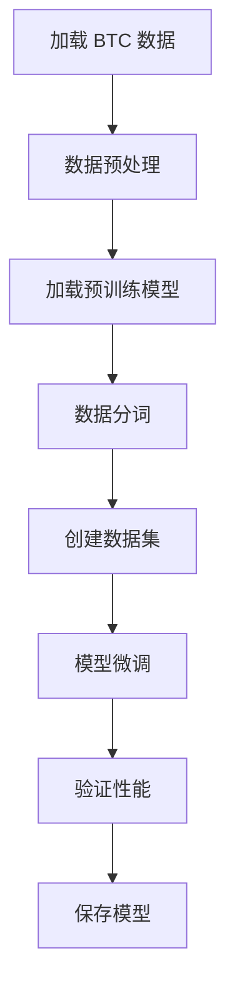

# Kronos BTC 微调项目

<div align="center">

[](https://python.org)
[](https://pytorch.org)
[](LICENSE)

**基于 Kronos 金融预测模型的 BTC 数据微调实践**

</div>

## 📖 项目简介

本项目是基于 [Kronos](https://github.com/shiyu-coder/Kronos) 金融预测模型的微调实践，专门针对 BTC/USDT 交易对进行模型优化。Kronos 是第一个开源的金融K线（蜡烛图）基础模型，在45个全球交易所的数据上进行训练。

本项目提供了完整的工作流程：
- 🔄 自动获取 BTC 历史和实时数据
- 🎯 使用真实 BTC 数据微调 Kronos 模型
- 📊 模型训练和验证
- 💾 微调模型保存和加载

## ✨ 核心功能

### 📈 数据获取模块
- **历史数据爬取**：获取指定时间范围的 BTC/USDT K线数据
- **实时数据监控**：持续获取最新市场数据
- **多格式输出**：支持 CSV 和 JSON 格式
- **数据统计**：自动生成详细的数据统计报告

### 🤖 模型微调
- **真实微调流程**：完整的两阶段微调（分词器 + 预测器）
- **分层词元处理**：使用 KronosTokenizer 进行数据分词
- **时间序列分割**：严格按时间顺序分割训练/验证/测试集
- **训练监控**：实时显示训练进度和损失变化

### 📊 数据处理
- **OHLCV 数据**：支持开盘价、最高价、最低价、收盘价、成交量、成交额
- **数据验证**：自动检查数据格式和完整性
- **预处理**：数据标准化和格式转换

## 🚀 快速开始

### 环境要求

- Python 3.10+
- PyTorch 2.0+
- CUDA 支持（推荐）

### 安装依赖

```bash
pip install -r requirements.txt
```

### 1. 获取 BTC 数据

#### 获取历史数据
```bash
cd get_btc_data
python get_Data_of_all.py
```

#### 启动实时数据监控
```bash
cd get_btc_data
python get_Data_of_realtime.py
```

### 2. 微调模型

```bash
python finetune_kronos.py
```

## 📁 项目结构

```
Kronos-of-my/
├── finetune_kronos.py          # 主微调脚本
├── requirements.txt            # 项目依赖
├── data/                       # 数据存储目录
│   ├── BTCUSDT_1h_*.csv       # BTC K线数据
│   └── BTCUSDT_1h_*.json      # JSON格式数据
├── get_btc_data/              # 数据获取模块
│   ├── get_Data_of_all.py     # 历史数据爬取
│   ├── get_Data_of_realtime.py # 实时数据监控
│   └── README.md              # 数据获取说明
├── Kronos/                    # Kronos 母项目（请勿修改）
├── Kronos-base/               # 预训练模型
└── output/                    # 输出目录
    ├── finetuned_kronos_btc.pth # 微调后的模型
    └── training_log.json      # 训练日志
```

## 🔧 详细使用说明

### 数据获取配置

#### 历史数据获取参数
```python
# get_btc_data/get_Data_of_all.py
symbol = "BTCUSDT"      # 交易对
interval = "1h"         # 时间框架
days = 90               # 获取天数
```

#### 实时数据监控参数
```python
# get_btc_data/get_Data_of_realtime.py
symbol = "BTCUSDT"          # 交易对
interval = "1h"             # 时间框架
update_interval = 60        # 更新间隔（秒）
backfill_hours = 24         # 启动时回填小时数
```

### 微调配置

主要配置参数在 `finetune_kronos.py` 中：

```python
config = {
    "data_path": "data/BTCUSDT_1h_20251018_220012.csv",
    "base_model_path": "Kronos-base",
    "tokenizer_id": "NeoQuasar/Kronos-Tokenizer-base",
    "output_model_path": "output/finetuned_kronos_btc.pth",
    "lookback_window": 512,      # 历史数据窗口
    "predict_window": 48,        # 预测窗口
    "epochs": 5,                 # 训练轮数
    "batch_size": 8,             # 批次大小
    "learning_rate": 1e-5,       # 学习率
    "device": "cuda"             # 设备选择
}
```

## 📊 微调流程

本项目实现了完整的 Kronos 微调流程：



### 微调步骤详解

1. **数据加载与预处理**
   - 读取 BTC K线数据
   - 提取 OHLCV 特征
   - 数据格式验证

2. **模型加载**
   - 加载预训练的 Kronos-base 模型
   - 加载对应的分词器
   - 设备配置（CPU/GPU）

3. **数据分词**
   - 使用 KronosTokenizer 将连续数据转换为离散词元
   - 生成分层词元序列
   - 处理上下文长度限制

4. **训练准备**
   - 时间序列数据分割
   - 创建训练和验证数据集
   - 配置优化器和损失函数

5. **模型微调**
   - 多轮训练循环
   - 实时损失监控
   - 验证集性能评估

6. **模型保存**
   - 保存微调后的模型权重
   - 记录训练日志
   - 生成性能报告

## 📈 训练示例

运行微调脚本后，您将看到类似以下的输出：

```
============================================================
KRONOS 真实微调流程
============================================================
  - data_path          : data/BTCUSDT_1h_20251018_220012.csv
  - base_model_path    : Kronos-base
  - tokenizer_id       : NeoQuasar/Kronos-Tokenizer-base
  - output_model_path  : output/finetuned_kronos_btc.pth
  - lookback_window    : 512
  - predict_window     : 48
  - epochs             : 5
  - batch_size         : 8
  - learning_rate      : 1e-05
  - device             : cuda
============================================================

Step 1: 正在加载并预处理数据...
数据加载成功，共 2160 条记录。

Step 2: 正在加载预训练模型和分词器...
分词器 'NeoQuasar/Kronos-Tokenizer-base' 加载成功。
预训练模型 'Kronos-base' 加载成功。
   模型总参数: 102.30M

Step 3: 正在将K线数据转换为金融词元 (Tokens)...
输入数据形状: torch.Size([2160, 6])
重塑后数据形状: torch.Size([1, 2160, 6])
数据分词成功，生成分层词元。
S1 tokens形状: torch.Size([1, 2160])
S2 tokens形状: torch.Size([1, 2160])

Step 4: 正在创建时间序列训练数据集...
数据分割: 训练集0-1512, 验证集1512-1944, 测试集1944-2160
训练样本数: 1001
验证样本数: 384
测试样本数: 0
训练数据集创建成功，共 1001 个样本。

Step 5: 开始微调训练...
Epoch 1/5: 100%|██████████| 126/126 [02:15<00:00,  1.07s/it, loss=3.456]
Epoch 1 完成, 平均损失: 4.234567
...
```

## 🎯 性能优化建议

### 硬件配置
- **GPU**：推荐使用 NVIDIA GPU（8GB+ 显存）
- **内存**：建议 16GB+ 系统内存
- **存储**：SSD 硬盘提升数据加载速度

### 训练参数调优
- **批次大小**：根据显存调整，通常 4-16
- **学习率**：1e-5 到 1e-4 之间
- **训练轮数**：5-20 轮，根据验证损失调整
- **上下文长度**：不超过模型最大限制（512）

## 🐛 常见问题

### Q1: 模型加载失败怎么办？
A: 检查网络连接，确保能够访问 Hugging Face 模型库。也可以考虑手动下载模型文件。

### Q2: 内存不足错误？
A: 减小批次大小或使用更小的模型（如 Kronos-small）。

### Q3: 训练速度很慢？
A: 确保使用 GPU 加速，检查 CUDA 安装是否正确。

### Q4: 数据获取失败？
A: 检查网络连接和币安 API 可用性，脚本已内置重试机制。

## 📝 开发计划

- [ ] 支持更多交易对
- [ ] 添加模型评估指标
- [ ] 实现分布式训练
- [ ] 添加可视化界面
- [ ] 支持实时预测

## 🤝 贡献指南

欢迎提交 Issue 和 Pull Request！

1. Fork 本项目
2. 创建特性分支 (`git checkout -b feature/AmazingFeature`)
3. 提交更改 (`git commit -m 'Add some AmazingFeature'`)
4. 推送到分支 (`git push origin feature/AmazingFeature`)
5. 开启 Pull Request


## 🙏 致谢

- [Kronos](https://github.com/shiyu-coder/Kronos) - 原始金融预测模型
- [Hugging Face](https://huggingface.co/) - 模型托管平台
- [币安](https://binance.com) - 数据来源

## 📞 联系方式

如有问题或建议，请通过以下方式联系：
- 提交 GitHub Issue
- 发送微信好友申请至菌子 [+8615252810681]

---

<div align="center">

**⭐ 如果这个项目对您有帮助，请给个 Star！**

</div>